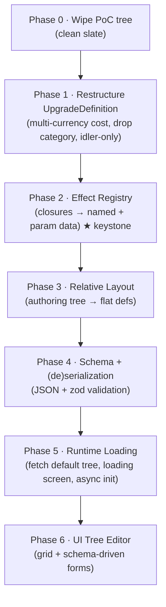

# MASTER PLAN: Data-Driven Upgrade Tree

> **Status:** design / under review.
> **Supersedes:** the original "Relative Upgrade-Tree Layout" plan, now folded in as **Phase 3**.
> This is a _master plan_: each phase is a milestone that will get its own detailed
> sub-plan before implementation. The goal here is the **right decomposition, ordering,
> and contracts** — not line-level implementation.

---

## Motivation

We want the upgrade tree to become **external, serializable data** that can be loaded
and saved at runtime, for three reasons:

1. **Bundle weight.** The tree will eventually be large. Keep the game lightweight; ship
   the engine, download the default tree (a data file) at startup behind a loading screen.
2. **Authoring effort.** Hand-crafting the tree in TypeScript is slow. We need a **UI tree
   editor**, which is only possible once the tree is data with a **save/load** mechanism.
3. **User-generated content.** Eventually players craft and share their own trees — which
   means loaded definitions must be **pure data that cannot execute arbitrary code**.

There is also accumulated cleanup we want to do _while we're in here_, since the current
tree is a proof-of-concept we already planned to discard.

---

## The keystone insight: you can serialize _data_, but not _behavior_

An upgrade today has two kinds of effect:

```ts
readonly modifiers: readonly Modifier[]                  // pure data → serializes trivially
readonly dynamicModifier?: (state) => Modifier | null    // a CLOSURE → cannot be serialized
```

`Modifier` is already `// pure data, serializable`. The blocker is the **closures**:
~6 behaviors in idler (`u8, u9, u10, u11, u12`, and the mode-level `collectIdlerDynamic`)
express their effect as JavaScript functions. Functions:

- cannot be written to a JSON/YAML file, and
- **must not** be loaded from one (loading user-authored code = remote-code-execution).

So "move the tree to a file" is **downstream** of a more fundamental refactor:
**represent dynamic behavior as data.** The professional answer is an **effect registry**
(Phase 2): the _implementation_ stays in code keyed by a name; the _tree data_ only
references `{ type: <name>, ...params }`. This single inversion unlocks serialization,
security, bundle savings, **and** the editor (a schema-driven form per registered effect).



---

## Locked decisions (from review)

| #   | Decision                                                                                                                                                                                                                                                          |
| --- | ----------------------------------------------------------------------------------------------------------------------------------------------------------------------------------------------------------------------------------------------------------------- |
| D1  | **Keep the `GameMode` abstraction**, but go **idler-only**: delete `clicker.ts` + `ClickerBot`. The mode plumbing stays so re-adding modes later is cheap.                                                                                                        |
| D2  | **Clicker-as-tree-panel** (clicker becomes an unlockable/upgradable panel via the tree) is a **future direction only** — noted, not designed here.                                                                                                                |
| D3  | On-disk format is **JSON** (native to JS, no parser dependency, editor reads/writes directly).                                                                                                                                                                    |
| D4  | `cost` becomes a **`Record<currency, amount>`** map (e.g. `{ r0: 15, r1: 5 }`); `costCurrency` is removed.                                                                                                                                                        |
| D5  | Phase order is as in the diagram above; relative-layout is folded in as **Phase 3** (not a separate earlier plan).                                                                                                                                                |
| D6  | **Generators stay scalar** this pass (single `baseCost` + `costCurrency`); they are not moved to multi-currency or data-driven yet. _(was Open Q A)_                                                                                                              |
| D7  | When the tree is wiped (Phase 0), **suspend the idler balance CI / envelope** until the new tree exists, rather than maintain a balance baseline for throwaway content. _(was Open Q B)_                                                                          |
| D8  | `costScaling` over a cost map scales **each currency entry by the same factor** (existing `linear`/`exponential` shape applied per-currency). _(was Open Q C)_                                                                                                    |
| D9  | "Cheapest upgrade" hotkey sorts by **score-resource-equivalent total** of the cost map. _(was Open Q D)_                                                                                                                                                          |
| D10 | The lobby mode-picker is **hidden when only one mode is available** (`AVAILABLE_MODES.length === 1`). _(was Open Q E)_                                                                                                                                            |
| D11 | The mode-level highlight becomes a **mode-level `effects` list**, for consistency with upgrade effects (no bespoke code hook). _(was Open Q F)_                                                                                                                   |
| D12 | Trees are **authored in TS and compiled to JSON at build** (type-safety during dev); JSON remains the runtime format. _(was Open Q G)_                                                                                                                            |
| D13 | The **server is authoritative**: it serves the tree file + version; both clients fetch the same versioned file. _(was Open Q H)_                                                                                                                                  |
| D14 | Each effect carries a **zod schema** (`EffectDef.schema`); the registry strips the `type` discriminant and validates params with it. One source of truth, feeds the Phase 6 editor. _(Phase 4)_                                                                   |
| D15 | The tree file is the **whole mode minus code** (resources, goals, flavor, generators, native + mode-level effects, nested offset tree) + `version`, so Phase 5 can ship the engine data-free. _(Phase 4)_                                                         |
| D16 | Phase 4 stays a pure data/behavior boundary: schema + `parseTree`/`serializeTree` + round-trip + version hook; idler keeps its **synchronous TS boot** (no fetch/build-emit until Phase 5). _(Phase 4)_                                                           |
| D17 | The server **owns + serves** the canonical tree files: it loads each `server/trees/*.json` at startup, registers it, and serves the raw bytes at `GET /trees/:mode.json`; both clients fetch from there. _(Phase 5)_                                              |
| D18 | `getModeDefinition` stays **synchronous** (throws if the mode is not loaded); modes are no longer auto-registered at import — startup calls an async `loadTree(json)` boundary first. _(Phase 5)_                                                                 |
| D19 | The emitted `server/trees/idler.json` is **committed**, with a byte-identical **drift-guard test**; `pnpm emit:trees` regenerates it manually (not wired into the build). _(Phase 5)_                                                                             |
| D20 | Phase 5 ships as a **single PR** to `main`. _(Phase 5)_                                                                                                                                                                                                           |
| D21 | A mode carries a **`flavors[]` array** (≥1), each with a stable `id`; the simulation is flavor-agnostic and the active flavor is resolved client-side via `getModeFlavor`, so players can pick different flavors and still compete in the same match. _(Phase 5)_ |

---

## Guiding principles

- **Data ≠ behavior.** Tree files carry data + named effect references; all executable
  logic lives in the versioned, code-reviewed engine.
- **One pure boundary.** A single `parseTree(json) → ModeDefinition` (Phase 4) is the only
  place untrusted data becomes an in-memory definition; it validates everything.
- **No behavior change until intended.** Phases 1–3 are mechanical refactors with green
  tests at every step. Behavior/content changes happen when we author the new tree.
- **Each phase ships independently** and is independently valuable.

---

## Phase 0 — Wipe the PoC tree (clean slate)

**Goal:** Remove all current idler tree nodes/flavor so later refactors aren't burdened by
preserving legacy content. This is the simplification the rest of the plan leans on.

- Reduce `idlerUpgrades` to an empty (or 1–2 placeholder) set; trim `idlerFlavor.upgrades`
  to match. Generators stay (separate axis, scalar cost — **D6**).
- **Consequence we _exploit_:** Phase 3 no longer needs to be "position-preserving."
  The original plan-16 offset table that reproduced exact coordinates is **dropped** —
  we'll author fresh positions.
- Keep validation green: every mechanical upgrade still needs a flavor entry, so wipe both
  sides together.

**Files:** `shared/src/modes/idler.ts`, idler flavor/balance envelope (suspend balance CI —
**D7**), affected `*.test.ts` fixtures, `BALANCE.md` references.

**Validation:** full suite green with the emptied tree; the game boots into an empty/near-empty tree.

---

## Phase 1 — Restructure `UpgradeDefinition` + remove clicker

**Goal:** Tidy the upgrade shape before layering data-driven concerns on top.

### 1a. Multi-currency cost (D4)

```ts
// before
readonly cost: number
readonly costCurrency?: string

// after
readonly cost: Readonly<Record<string, number>>   // e.g. { r0: 15 } or { r0: 15, r1: 5 }
```

- `canAfford`: every entry must be satisfied (`∀ c: resources[c] ≥ cost[c]`).
- `applyPurchase`: subtract each currency.
- **`costScaling`** currently scales a single number — with a cost map it scales
  **each entry by the same factor** (existing `linear`/`exponential` shape applied
  per-currency — **D8**).
- Update all consumers found in audit: `client/src/game.ts` (`doBuy`, reconciliation),
  `client/src/ui/helpers.ts` (`canBuy`, cost label), `upgrade-detail.ts`,
  `components.ts`, `hotkeys.ts` (cheapest-sort uses score-resource-equivalent total —
  **D9**), `generators-panel.ts` (generators keep scalar cost — **D6**),
  `client/src/dev/*`, `scripts/simulate-idler.ts`.

> **Follow-up (revisit later):** `getUpgradeBulkCost` and `getMaxAffordableUpgradeLevels`
> in `shared/src/upgrade-costs.ts` are currently exercised only by unit tests — no gameplay
> path calls them (bulk-buy isn't wired for idler upgrades). Keep for now; when bulk-buy
> lands, wire them in, otherwise prune them. Likewise the per-upgrade `costScaling` machinery
> is unused by any shipping upgrade — see the `costScaleMultiplier` doc for its
> `baseCost`-as-reference-denominator semantics before relying on it.

### 1b. Drop `category`

- Idler has no flat upgrades; **all** upgrades are tree upgrades. Remove `UpgradeCategory`
  and the `category` field.
- Update consumers: `components.ts` (`.filter(u => u.category === 'tree')` → use all),
  `mode-ui.ts` (`some(u => u.category === 'tree')` → driven by a mode capability flag instead),
  `hotkeys.ts` (`category ?? 'play'` filter).
- The play panel no longer hosts upgrades (idler play panel = currency cards only).
  `renderClickerUpgrades` is removed with clicker (1c).

### 1c. Remove clicker mode (D1)

- Delete `shared/src/modes/clicker.ts`; remove from `MODE_REGISTRY`.
- Delete `ClickerBot` (`server/src/bot.ts`); `createBot` always returns the idler strategy.
- `GameMode` type, lobby mode-picker, and matchmaking settings **stay** (idler is the only
  member for now). Default mode/goal already idler + race-to-buy.
- Update tests that construct `'clicker'`: `server/tests/{match,matchmaking,validation,bot}.test.ts`,
  client tests, and the `renderClickerUpgrades` tests. The lobby mode-picker is **hidden
  when only one mode is available** (`AVAILABLE_MODES.length === 1` — **D10**).
- `theme-clicker` CSS + `lint-css` ignore entry removed.

**Validation:** full suite green; idler-only boot; no `clicker` references remain (grep gate).

---

## Phase 2 — Effect registry (★ keystone) — ✅ done

**Goal:** Introduce a **named, parameterized, serializable effect** registry to replace
ad-hoc state-derived modifier closures, and migrate the one live dynamic behavior onto it.

> **Reality check (Phase 0 fallout):** the proof-of-concept per-upgrade closures
> (`u8`–`u12`) were already wiped to a minimal stub in Phase 0. The **only** live
> state-derived behavior left was the mode-level highlight ×2. So Phase 2 builds the
> registry infrastructure and migrates **just** `highlightMultiplier`. The remaining
> effects (banked-resource bonus, dominant/balanced generator, time growth) are **not**
> speculative scaffolding here — they are authored on demand in Phase 3+ when real tree
> nodes need them. (**YAGNI**.)

### Registry shape (as built)

```ts
// shared/src/effects/registry.ts (NEW)
interface EffectDef<P> {
  readonly parse: (raw: EffectRef) => P // validate + narrow; mirrors zod's `.parse`
  readonly apply: (p: P, state: Readonly<PlayerState>) => Modifier | null
}
function registerEffect<P>(type: string, def: EffectDef<P>): void
function resolveEffect(type: string): EffectDef<unknown> | undefined
function applyEffect(ref: EffectRef, state): Modifier | null // resolve → parse → apply; throws on unknown type
```

Tree / mode data carries declarative refs:

```ts
// idler `uh` upgrade definition (data, not a closure)
effects: [
  { type: 'highlightMultiplier', multiplier: 2, boostUpgradeId: 'uh2', boostedMultiplier: 3 },
]
```

### Why `parse` instead of a zod schema (deferred)

The keystone justification for effects is _self-describing params → editor forms_, which
is naturally a zod schema. We **deferred zod** for now because:

- The only consumers today are TS-authored data — already compiler-checked. There is **no
  untrusted input** until the Phase 4 JSON boundary, which is the real validation seam.
- Adding a runtime dependency to `@game/shared` (shipped to both client and server) for a
  single effect is premature.
- `EffectDef.parse(raw) => P` deliberately mirrors zod's `.parse` signature, so Phase 4 can
  drop in `schema.parse` (and attach the schema object for Phase 6 editor introspection)
  **with no call-site churn**. The interface is the forward-compatible seam.

### Seed effect library

| Effect type           | Replaces              | Params (as built)                                     |
| --------------------- | --------------------- | ----------------------------------------------------- |
| `highlightMultiplier` | `collectIdlerDynamic` | `{ multiplier, boostUpgradeId?, boostedMultiplier? }` |

Future effects (`bankedResourceBonus`, `dominantGenerator`, `balancedGenerators`,
`timeGrowth`, …) are added to this table as Phase 3+ tree nodes require them.

### Type / wiring changes (done)

- Replaced `UpgradeDefinition.dynamicModifier?: (state) => …` with
  `effects?: readonly EffectRef[]` (pure data). New `EffectRef` type in `types.ts`.
- Replaced the mode-level `ModeDefinition.collectDynamic?` hook with a mode-level
  `effects?: readonly EffectRef[]` list (**D11**) — same registry, no bespoke code hook.
- `collectModifiers` runs static `modifiers` then mode-level and per-upgrade `effects` via
  `applyEffect`, preserving the generator-field routing for both.
- Seed effects register at module load; `modes/index.ts` imports the effects barrel so
  registration runs whenever `collectModifiers` is reachable (incl. direct test imports).

**Validation:** ✅ behavior-identical highlight output vs. the old closure (golden tests on
several states); registry rejects unknown effect types and malformed params; full suite
green (shared 133 / server 104 / client 134), typecheck + eslint + format + knip clean.

---

## Phase 3 — Relative layout (authoring tree → flat defs) — ✅ done

_(Folds in the original plan-16 design; position-preservation constraint dropped per Phase 0.)_

**Goal:** Author the tree as a nested structure where each node's position is **relative to
its layout parent**, so moving a branch is a one-line offset change. Establishes the
extension point for **branch-level inheritance** (e.g. color a branch via its root).

> **Reality check:** the stub started as 3 independent nodes. Most stay **roots** whose
> `offset` equals their absolute position (**faithful conversion** — no fabricated
> relationships). As a smoke test of the layout system, one real nested child was added:
> `uh2` (Sharper Focus) is a layout child of `uh` (offset `0,150`) with a `prerequisites`
> link to `uh`, and it raises the highlight multiplier 2 → 3 via a `boostUpgradeId` tier on
> `uh`'s per-upgrade `highlightMultiplier` effect (co-located with the unlock it modifies).
> This exercises nesting, relative-offset
> resolution, prerequisite-edge rendering, and effect tiering end-to-end.

### The two-relationships separation (core of the original plan)

| Relationship      | Shape                           | Representation                         |
| ----------------- | ------------------------------- | -------------------------------------- |
| **Prerequisites** | DAG (multi-parent `u6 OR u7`)   | `prerequisites` expression — unchanged |
| **Layout/visual** | Tree (one position, one branch) | nested `children` + relative `offset`  |

`children` are **layout** children (drawn relative to me, inherit my branch props),
**not** prerequisites. A node with two prereq-parents still lives at one spot in the
layout tree; its gating stays in `prerequisites`, and the renderer keeps drawing edges
from `prerequisites` (so both incoming edges still render).

### Authoring type + flattener (as built)

```ts
// shared/src/modes/upgrade-tree.ts (NEW)
interface UpgradeTreeNode extends Omit<UpgradeDefinition, 'position'> {
  readonly offset: UpgradePosition // relative to layout parent
  readonly children?: readonly UpgradeTreeNode[]
}
function flattenUpgradeTree(roots: readonly UpgradeTreeNode[]): readonly UpgradeDefinition[]
```

- Flatten resolves absolute `position = parentAbs + offset`, recursing through `children`.
- **No cycle detection needed** (literal nested objects can't cycle); only **duplicate-id**
  detection (a dup would corrupt the flat id-keyed maps).
- Output is the same flat `UpgradeDefinition[]` the engine + renderer already consume, so
  **nothing downstream changes** — renderer keeps reading absolute `position`. `idler` now
  authors its upgrades as a tree and flattens at module load.
- The `branch?` field is **not** added yet (Phase 3b, deferred — no unused field now).

### Branch inheritance (Phase 3b — designed, deferred)

`branch?: { color?, … }`, resolved as `{ ...parentResolved, ...child.branch }` during
flatten. Output target (field on def vs. sibling `Map<id, ResolvedBranch>`) decided when a
renderer consumes it. **Do not add an unused field now.**

**Validation:** ✅ flattener unit tests (root resolution, depth accumulation, full
enumeration, duplicate-id throw, gameplay-field passthrough with `offset`/`children`
dropped, empty input); idler tree flattens to the prior absolute positions; full suite
green (shared 142 / server 104 / client 134), typecheck + eslint + format + knip clean.

---

## Phase 4 — Schema + (de)serialization (JSON + zod)

**Goal:** Define the on-disk JSON shape and a single validated boundary between data and engine.

- `TreeFileSchema` (zod) covers: version, generators, resources/flavor, and the **nested
  authoring tree** (relative offsets from Phase 3), with each node's `cost` map (Phase 1),
  `prerequisites` expression, static `modifiers`, and `effects` (each validated against its
  registered param schema from Phase 2).
- `parseTree(json) → ModeDefinition` — the **only** trust boundary: zod-validate → flatten
  (Phase 3) → run existing `validateModeDefinition` / prereq / choice-group checks.
- `serializeTree(authoringTree) → json` — inverse, for save (and the editor).
- **Round-trip test:** `serialize ∘ parse` is identity on a canonical tree.
- Versioning + migration hook from day one (schema `version` field).
- Trees are **authored in TS and compiled to JSON at build** (**D12**) for dev-time
  type-safety; JSON is the runtime format consumed by `parseTree`.

**As built:** `shared/src/tree/` holds `schema.ts` (zod `TreeFileSchema` over the **whole
mode minus code** — resources, scoreResource, goals, flavor, generators, native + mode-level
effects, and the nested offset tree; **D15**) and `codec.ts`
(`parseTreeFile` → `toModeDefinition` → `parseTree`, plus `serializeTree` and the
`migrateTreeFile` version hook). Two file-format details: `purchaseLimit` is `number | null`
(`null` = unlimited, since JSON can't encode `Infinity`; mapped back at the boundary), and
positions are stored as relative `offset`s flattened by Phase 3's `flattenUpgradeTree`.
Effect params are now validated by **per-effect zod schemas** (**D14**): `EffectDef.parse`
was replaced by `EffectDef.schema`, the registry strips the `type` discriminant and runs
`schema.parse`, and `highlightMultiplier` is a strict `z.union` (the both-or-neither boost
pairing is enforced structurally). Idler keeps its synchronous TS boot (**D16**); the
build-to-JSON emit + async fetch land in Phase 5.

**Validation:** ✅ tree codec tests (idler `parseTree` ≡ hand-authored mode; serialize→parse
round-trip + deterministic re-serialize; `null`↔`Infinity` sentinel; missing/unsupported
version; structural, duplicate-id, unknown-effect-type, and malformed-effect-param failures);
full suite green (shared 159 / server 104 / client 134), typecheck + eslint + format + knip clean.

---

## Phase 5 — Runtime loading (fetch tree, loading screen, async init) — ✅ done

**Goal:** Ship the engine without the tree; fetch the default tree JSON at startup.

- Make mode init **async**: fetch default tree → `parseTree` → register mode → start.
- **Loading screen** while fetching/parsing; error state on fetch/validation failure.
- Bundle no longer contains the tree data (reason #1 payoff).
- Server and client must agree on the active tree (multiplayer integrity) — the **server is
  authoritative**: it serves the tree file + version, and both clients fetch the same
  versioned file (**D13**).

**As built:** The mode registry is now an empty `Map` at import — modes are registered at
runtime via `loadTree(json)` (parse → `toModeDefinition` → `registerMode`), and
`getModeDefinition` throws a clear "not loaded — call `loadTree()` at startup" error if used
before init (**D18**). `AVAILABLE_MODES` is decoupled from the registry (a static list) so the
lobby still works pre-load. Tree JSON is **emitted from the TS source** by
`shared/src/tree/authoring.ts` (`toTreeFile`) + `buildIdlerTreeFile`, surfaced through a
manual `pnpm emit:trees` script that writes `server/trees/idler.json` (committed; **D19**).
The **server owns + serves** the trees (**D17**): at startup it reads each
`server/trees/*.json`, registers it, and caches the raw bytes; `GET /trees/:mode.json` serves
them verbatim (CORS + `Cache-Control: no-cache`). The client fetches `trees/idler.json` after
the health check and before the WebSocket opens, with new `loading` / `load-error` connection
states driving a loading spinner and a retryable error screen. The dev panel registers the
bundled tree directly (offline). Per-package vitest `setupFiles` register the idler tree
before tests; the few `vi.resetModules()` suites re-register on the fresh instance.

Flavor was also generalized to a **`flavors[]` array** (≥1, each with a stable `id`; **D21**):
the simulation is flavor-agnostic, `validateModeDefinition` checks every flavor covers the
same mechanics + enforces unique ids, and render code resolves the active flavor through the
new `getModeFlavor(mode, flavorId?)` seam (defaulting to the first) — the single hook a future
flavor-picker plugs into. Idler ships one flavor (`medieval`) for now.

**Validation:** ✅ byte-identical drift-guard test (`server/trees/idler.json` ≡
`serializeTree(buildIdlerTreeFile())`) + parseable-from-disk check; multi-flavor validation +
`getModeFlavor` resolution tests; full suite green (shared 168 / server 106 / client 134),
typecheck + eslint + format + knip + lint:css clean.

---

## Phase 6 — UI tree editor

**Goal:** Author trees visually; the difficulty you flagged (`modifiers` / dynamic effects)
**dissolves** because effects are now named + self-describing (Phase 2).

- **Canvas:** grid; nodes placed by relative offset (Phase 3); drag to re-parent/move a
  branch; edges drawn from `prerequisites`.
- **Inspector (selected node):** simple inputs for `id`, `cost` map, `purchaseLimit`,
  `prerequisites` builder, `choiceGroup`.
- **Static modifiers:** small list editor (`stage` dropdown, `field` dropdown, `value`).
- **Dynamic effects:** dropdown of **registered effect type names**; selecting one
  **generates a form from that effect's zod param schema** (number/resource/generator
  inputs). Adding a new effect in code automatically makes it editable — no editor changes.
- **Save/Load:** `serializeTree`/`parseTree` (Phase 4); export/import JSON; load into a live
  game to playtest (reason #2 + #3 payoff).

---

## Future directions (noted, not designed here)

- **Clicker-as-panel (D2):** the clicker becomes an in-tree unlockable/upgradable panel
  rather than a separate mode. The effect registry + multi-currency cost + data-driven tree
  are the prerequisites that make this expressible as data.
- **User-generated trees / sharing:** enabled by the pure-data + validated-boundary design
  (no code in tree files).
- **Multiple modes again:** `GameMode` plumbing was retained (D1) precisely so this is cheap.

---

## Resolved decisions A–H

These were open during review and are now **locked** (see the decisions table at the top,
rows **D6–D13**):

| Was | Question                                                 | Resolution (D#)                                     |
| --- | -------------------------------------------------------- | --------------------------------------------------- |
| A   | Generators → multi-currency/data-driven, or stay scalar? | Stay scalar (**D6**)                                |
| B   | Idler balance envelope when the tree is wiped?           | Suspend balance CI (**D7**)                         |
| C   | `costScaling` over a cost map?                           | Per-currency same factor (**D8**)                   |
| D   | Cheapest-sort scalar from a cost map?                    | Score-resource-equivalent total (**D9**)            |
| E   | Lobby mode-picker with one mode?                         | Hide when length === 1 (**D10**)                    |
| F   | Mode-level highlight: effect vs code hook?               | Mode-level effect (**D11**)                         |
| G   | Author TS→JSON vs hand-author JSON?                      | TS→JSON at build (**D12**)                          |
| H   | How does the server pin/serve the active tree version?   | Server authoritative, serves file+version (**D13**) |

---

## Out of scope

- Changing the prerequisite **DAG** semantics (only its authoring location moves in Phase 3).
- Designing clicker-as-panel (D2).
- Rendering branch colors (Phase 3b consumer).
- Prestige/perks/other roadmap systems.
