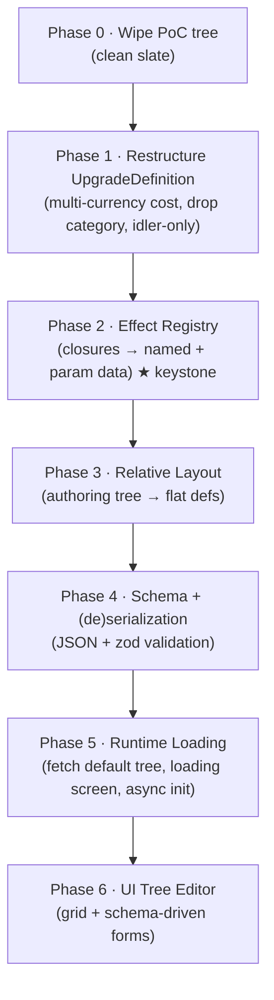

# MASTER PLAN: Data-Driven Upgrade Tree

> **Status:** design / under review.
> **Supersedes:** the original "Relative Upgrade-Tree Layout" plan, now folded in as **Phase 3**.
> This is a _master plan_: each phase is a milestone that will get its own detailed
> sub-plan before implementation. The goal here is the **right decomposition, ordering,
> and contracts** — not line-level implementation.

---

## Motivation

We want the upgrade tree to become **external, serializable data** that can be loaded
and saved at runtime, for three reasons:

1. **Bundle weight.** The tree will eventually be large. Keep the game lightweight; ship
   the engine, download the default tree (a data file) at startup behind a loading screen.
2. **Authoring effort.** Hand-crafting the tree in TypeScript is slow. We need a **UI tree
   editor**, which is only possible once the tree is data with a **save/load** mechanism.
3. **User-generated content.** Eventually players craft and share their own trees — which
   means loaded definitions must be **pure data that cannot execute arbitrary code**.

There is also accumulated cleanup we want to do _while we're in here_, since the current
tree is a proof-of-concept we already planned to discard.

---

## The keystone insight: you can serialize _data_, but not _behavior_

An upgrade today has two kinds of effect:

```ts
readonly modifiers: readonly Modifier[]                  // pure data → serializes trivially
readonly dynamicModifier?: (state) => Modifier | null    // a CLOSURE → cannot be serialized
```

`Modifier` is already `// pure data, serializable`. The blocker is the **closures**:
~6 behaviors in idler (`u8, u9, u10, u11, u12`, and the mode-level `collectIdlerDynamic`)
express their effect as JavaScript functions. Functions:

- cannot be written to a JSON/YAML file, and
- **must not** be loaded from one (loading user-authored code = remote-code-execution).

So "move the tree to a file" is **downstream** of a more fundamental refactor:
**represent dynamic behavior as data.** The professional answer is an **effect registry**
(Phase 2): the _implementation_ stays in code keyed by a name; the _tree data_ only
references `{ type: <name>, ...params }`. This single inversion unlocks serialization,
security, bundle savings, **and** the editor (a schema-driven form per registered effect).



---

## Locked decisions (from review)

| #   | Decision                                                                                                                                                                                 |
| --- | ---------------------------------------------------------------------------------------------------------------------------------------------------------------------------------------- |
| D1  | **Keep the `GameMode` abstraction**, but go **idler-only**: delete `clicker.ts` + `ClickerBot`. The mode plumbing stays so re-adding modes later is cheap.                               |
| D2  | **Clicker-as-tree-panel** (clicker becomes an unlockable/upgradable panel via the tree) is a **future direction only** — noted, not designed here.                                       |
| D3  | On-disk format is **JSON** (native to JS, no parser dependency, editor reads/writes directly).                                                                                           |
| D4  | `cost` becomes a **`Record<currency, amount>`** map (e.g. `{ r0: 15, r1: 5 }`); `costCurrency` is removed.                                                                               |
| D5  | Phase order is as in the diagram above; relative-layout is folded in as **Phase 3** (not a separate earlier plan).                                                                       |
| D6  | **Generators stay scalar** this pass (single `baseCost` + `costCurrency`); they are not moved to multi-currency or data-driven yet. _(was Open Q A)_                                     |
| D7  | When the tree is wiped (Phase 0), **suspend the idler balance CI / envelope** until the new tree exists, rather than maintain a balance baseline for throwaway content. _(was Open Q B)_ |
| D8  | `costScaling` over a cost map scales **each currency entry by the same factor** (existing `linear`/`exponential` shape applied per-currency). _(was Open Q C)_                           |
| D9  | "Cheapest upgrade" hotkey sorts by **score-resource-equivalent total** of the cost map. _(was Open Q D)_                                                                                 |
| D10 | The lobby mode-picker is **hidden when only one mode is available** (`AVAILABLE_MODES.length === 1`). _(was Open Q E)_                                                                   |
| D11 | The mode-level highlight becomes a **mode-level `effects` list**, for consistency with upgrade effects (no bespoke code hook). _(was Open Q F)_                                          |
| D12 | Trees are **authored in TS and compiled to JSON at build** (type-safety during dev); JSON remains the runtime format. _(was Open Q G)_                                                   |
| D13 | The **server is authoritative**: it serves the tree file + version; both clients fetch the same versioned file. _(was Open Q H)_                                                         |

---

## Guiding principles

- **Data ≠ behavior.** Tree files carry data + named effect references; all executable
  logic lives in the versioned, code-reviewed engine.
- **One pure boundary.** A single `parseTree(json) → ModeDefinition` (Phase 4) is the only
  place untrusted data becomes an in-memory definition; it validates everything.
- **No behavior change until intended.** Phases 1–3 are mechanical refactors with green
  tests at every step. Behavior/content changes happen when we author the new tree.
- **Each phase ships independently** and is independently valuable.

---

## Phase 0 — Wipe the PoC tree (clean slate)

**Goal:** Remove all current idler tree nodes/flavor so later refactors aren't burdened by
preserving legacy content. This is the simplification the rest of the plan leans on.

- Reduce `idlerUpgrades` to an empty (or 1–2 placeholder) set; trim `idlerFlavor.upgrades`
  to match. Generators stay (separate axis, scalar cost — **D6**).
- **Consequence we _exploit_:** Phase 3 no longer needs to be "position-preserving."
  The original plan-16 offset table that reproduced exact coordinates is **dropped** —
  we'll author fresh positions.
- Keep validation green: every mechanical upgrade still needs a flavor entry, so wipe both
  sides together.

**Files:** `shared/src/modes/idler.ts`, idler flavor/balance envelope (suspend balance CI —
**D7**), affected `*.test.ts` fixtures, `BALANCE.md` references.

**Validation:** full suite green with the emptied tree; the game boots into an empty/near-empty tree.

---

## Phase 1 — Restructure `UpgradeDefinition` + remove clicker

**Goal:** Tidy the upgrade shape before layering data-driven concerns on top.

### 1a. Multi-currency cost (D4)

```ts
// before
readonly cost: number
readonly costCurrency?: string

// after
readonly cost: Readonly<Record<string, number>>   // e.g. { r0: 15 } or { r0: 15, r1: 5 }
```

- `canAfford`: every entry must be satisfied (`∀ c: resources[c] ≥ cost[c]`).
- `applyPurchase`: subtract each currency.
- **`costScaling`** currently scales a single number — with a cost map it scales
  **each entry by the same factor** (existing `linear`/`exponential` shape applied
  per-currency — **D8**).
- Update all consumers found in audit: `client/src/game.ts` (`doBuy`, reconciliation),
  `client/src/ui/helpers.ts` (`canBuy`, cost label), `upgrade-detail.ts`,
  `components.ts`, `hotkeys.ts` (cheapest-sort uses score-resource-equivalent total —
  **D9**), `generators-panel.ts` (generators keep scalar cost — **D6**),
  `client/src/dev/*`, `scripts/simulate-idler.ts`.

### 1b. Drop `category`

- Idler has no flat upgrades; **all** upgrades are tree upgrades. Remove `UpgradeCategory`
  and the `category` field.
- Update consumers: `components.ts` (`.filter(u => u.category === 'tree')` → use all),
  `mode-ui.ts` (`some(u => u.category === 'tree')` → driven by a mode capability flag instead),
  `hotkeys.ts` (`category ?? 'play'` filter).
- The play panel no longer hosts upgrades (idler play panel = currency cards only).
  `renderClickerUpgrades` is removed with clicker (1c).

### 1c. Remove clicker mode (D1)

- Delete `shared/src/modes/clicker.ts`; remove from `MODE_REGISTRY`.
- Delete `ClickerBot` (`server/src/bot.ts`); `createBot` always returns the idler strategy.
- `GameMode` type, lobby mode-picker, and matchmaking settings **stay** (idler is the only
  member for now). Default mode/goal already idler + race-to-buy.
- Update tests that construct `'clicker'`: `server/tests/{match,matchmaking,validation,bot}.test.ts`,
  client tests, and the `renderClickerUpgrades` tests. The lobby mode-picker is **hidden
  when only one mode is available** (`AVAILABLE_MODES.length === 1` — **D10**).
- `theme-clicker` CSS + `lint-css` ignore entry removed.

**Validation:** full suite green; idler-only boot; no `clicker` references remain (grep gate).

---

## Phase 2 — Effect registry (★ keystone)

**Goal:** Replace inline `dynamicModifier` closures (and the mode-level `collectDynamic`)
with **named, parameterized, serializable effects**.

### Registry shape

```ts
// shared/src/effects/registry.ts (NEW)
interface EffectDef<P> {
  readonly params: ZodSchema<P> // self-describing → drives editor forms
  readonly apply: (p: P, state: Readonly<PlayerState>) => Modifier | null
}
function registerEffect<P>(type: string, def: EffectDef<P>): void
function resolveEffect(type: string): EffectDef<unknown> | undefined
function applyEffect(ref: EffectRef, state): Modifier | null // validates params, runs apply
```

Tree data carries declarative refs:

```ts
// before (closure)
dynamicModifier: (s) => { const b = Math.min(s.resources.r0 * 0.001, 1); return b>0 ? {…} : null }

// after (data)
effects: [{ type: 'bankedResourceBonus', field: 'r0', perUnit: 0.001, cap: 1 }]
```

### Seed effect library (derived from current closures)

| Effect type           | Replaces              | Params                                               |
| --------------------- | --------------------- | ---------------------------------------------------- |
| `bankedResourceBonus` | `u8`, `u9`            | `{ field, perUnit, cap }`                            |
| `dominantGenerator`   | `u10`                 | `{ generators[], factor }`                           |
| `balancedGenerators`  | `u11`                 | `{ generators[], maxBonus }`                         |
| `timeGrowth`          | `u12`                 | `{ field: 'globalMultiplier', perSec, cap }`         |
| `highlightMultiplier` | `collectIdlerDynamic` | `{ base, boosted, boostUpgradeId, unlockUpgradeId }` |

> Note: `u8` and `u9` collapse into **one** reusable effect — exactly the consolidation
> that makes a tree authorable by non-programmers and editable in a UI.

- Replace `UpgradeDefinition.dynamicModifier?: (state) => …` with
  `effects?: readonly EffectRef[]` (pure data).
- `collectModifiers` runs static `modifiers` then `effects` via `applyEffect`.
- The mode-level `collectDynamic` (highlight) becomes a **mode-level `effects` list**
  (**D11**) — same registry, no bespoke code hook.

**Validation:** behavior-identical numeric output vs. the old closures (golden test on a few
states); param schemas reject malformed effects.

---

## Phase 3 — Relative layout (authoring tree → flat defs)

_(Folds in the original plan-16 design; position-preservation constraint dropped per Phase 0.)_

**Goal:** Author the tree as a nested structure where each node's position is **relative to
its layout parent**, so moving a branch is a one-line offset change. Establishes the
extension point for **branch-level inheritance** (e.g. color a branch via its root).

### The two-relationships separation (core of the original plan)

| Relationship      | Shape                           | Representation                         |
| ----------------- | ------------------------------- | -------------------------------------- |
| **Prerequisites** | DAG (multi-parent `u6 OR u7`)   | `prerequisites` expression — unchanged |
| **Layout/visual** | Tree (one position, one branch) | nested `children` + relative `offset`  |

`children` are **layout** children (drawn relative to me, inherit my branch props),
**not** prerequisites. A node with two prereq-parents still lives at one spot in the
layout tree; its gating stays in `prerequisites`, and the renderer keeps drawing edges
from `prerequisites` (so both incoming edges still render).

### Authoring type + flattener

```ts
// shared/src/modes/upgrade-tree.ts (NEW)
interface UpgradeTreeNode extends Omit<UpgradeDefinition, 'position'> {
  readonly offset: UpgradePosition // relative to layout parent
  readonly branch?: BranchStyle // Phase-3b cosmetic inheritance (deferred)
  readonly children?: readonly UpgradeTreeNode[]
}
function flattenUpgradeTree(roots: readonly UpgradeTreeNode[]): readonly UpgradeDefinition[]
```

- Flatten resolves absolute `position = parentAbs + offset`, recursing through `children`.
- **No cycle detection needed** (literal nested objects can't cycle); only **duplicate-id**
  detection. This is a concrete simplicity win over an anchor-by-id scheme.
- Output is the same flat `UpgradeDefinition[]` the engine + renderer already consume, so
  **nothing downstream changes** — renderer keeps reading absolute `position`.

### Branch inheritance (Phase 3b — designed, deferred)

`branch?: { color?, … }`, resolved as `{ ...parentResolved, ...child.branch }` during
flatten. Output target (field on def vs. sibling `Map<id, ResolvedBranch>`) decided when a
renderer consumes it. **Do not add an unused field now.**

**Validation:** unit tests on the flattener (absolute resolution, depth accumulation,
duplicate-id throw, gameplay fields pass through verbatim).

---

## Phase 4 — Schema + (de)serialization (JSON + zod)

**Goal:** Define the on-disk JSON shape and a single validated boundary between data and engine.

- `TreeFileSchema` (zod) covers: version, generators, resources/flavor, and the **nested
  authoring tree** (relative offsets from Phase 3), with each node's `cost` map (Phase 1),
  `prerequisites` expression, static `modifiers`, and `effects` (each validated against its
  registered param schema from Phase 2).
- `parseTree(json) → ModeDefinition` — the **only** trust boundary: zod-validate → flatten
  (Phase 3) → run existing `validateModeDefinition` / prereq / choice-group checks.
- `serializeTree(authoringTree) → json` — inverse, for save (and the editor).
- **Round-trip test:** `serialize ∘ parse` is identity on a canonical tree.
- Versioning + migration hook from day one (schema `version` field).
- Trees are **authored in TS and compiled to JSON at build** (**D12**) for dev-time
  type-safety; JSON is the runtime format consumed by `parseTree`.

---

## Phase 5 — Runtime loading + loading screen

**Goal:** Ship the engine without the tree; fetch the default tree JSON at startup.

- Make mode init **async**: fetch default tree → `parseTree` → register mode → start.
- **Loading screen** while fetching/parsing; error state on fetch/validation failure.
- Bundle no longer contains the tree data (reason #1 payoff).
- Server and client must agree on the active tree (multiplayer integrity) — the **server is
  authoritative**: it serves the tree file + version, and both clients fetch the same
  versioned file (**D13**).

---

## Phase 6 — UI tree editor

**Goal:** Author trees visually; the difficulty you flagged (`modifiers` / dynamic effects)
**dissolves** because effects are now named + self-describing (Phase 2).

- **Canvas:** grid; nodes placed by relative offset (Phase 3); drag to re-parent/move a
  branch; edges drawn from `prerequisites`.
- **Inspector (selected node):** simple inputs for `id`, `cost` map, `purchaseLimit`,
  `prerequisites` builder, `choiceGroup`.
- **Static modifiers:** small list editor (`stage` dropdown, `field` dropdown, `value`).
- **Dynamic effects:** dropdown of **registered effect type names**; selecting one
  **generates a form from that effect's zod param schema** (number/resource/generator
  inputs). Adding a new effect in code automatically makes it editable — no editor changes.
- **Save/Load:** `serializeTree`/`parseTree` (Phase 4); export/import JSON; load into a live
  game to playtest (reason #2 + #3 payoff).

---

## Future directions (noted, not designed here)

- **Clicker-as-panel (D2):** the clicker becomes an in-tree unlockable/upgradable panel
  rather than a separate mode. The effect registry + multi-currency cost + data-driven tree
  are the prerequisites that make this expressible as data.
- **User-generated trees / sharing:** enabled by the pure-data + validated-boundary design
  (no code in tree files).
- **Multiple modes again:** `GameMode` plumbing was retained (D1) precisely so this is cheap.

---

## Resolved decisions A–H

These were open during review and are now **locked** (see the decisions table at the top,
rows **D6–D13**):

| Was | Question                                                 | Resolution (D#)                                     |
| --- | -------------------------------------------------------- | --------------------------------------------------- |
| A   | Generators → multi-currency/data-driven, or stay scalar? | Stay scalar (**D6**)                                |
| B   | Idler balance envelope when the tree is wiped?           | Suspend balance CI (**D7**)                         |
| C   | `costScaling` over a cost map?                           | Per-currency same factor (**D8**)                   |
| D   | Cheapest-sort scalar from a cost map?                    | Score-resource-equivalent total (**D9**)            |
| E   | Lobby mode-picker with one mode?                         | Hide when length === 1 (**D10**)                    |
| F   | Mode-level highlight: effect vs code hook?               | Mode-level effect (**D11**)                         |
| G   | Author TS→JSON vs hand-author JSON?                      | TS→JSON at build (**D12**)                          |
| H   | How does the server pin/serve the active tree version?   | Server authoritative, serves file+version (**D13**) |

---

## Out of scope

- Changing the prerequisite **DAG** semantics (only its authoring location moves in Phase 3).
- Designing clicker-as-panel (D2).
- Rendering branch colors (Phase 3b consumer).
- Prestige/perks/other roadmap systems.
