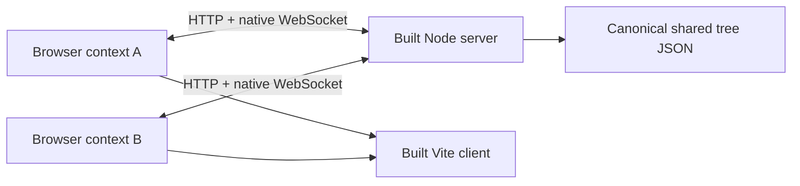

# 26 — Production-faithful end-to-end testing

Status: **Implemented on `test/e2e-integration`.**

## Verdict

**Modify, then adopt — high confidence.** What would change this verdict: if the suite required a
privileged test API or mocked WebSocket server to stay deterministic, reduce its scope
rather than ship tests that exercise a different system from production.

### Red-team objection first

The failure mode is not “too few browser tests”; it is a large, slow suite that repeats
Vitest coverage, depends on wall-clock sleeps, and turns harmless UI edits into flaky CI.
This application compounds that risk because it has multiple browser contexts, a real-time server,
action batching, server broadcasts, random quick-match settings, and long safety caps.

This plan avoids that trap:

- E2E tests cover only browser/runtime/process boundaries that current tests cannot prove.
- The built client, built server, production tree, native browser `WebSocket`, and real
  timers are used. There is no fake backend.
- Deterministic room settings and the existing low-cost opening state provide all required
  scenarios. No resource-granting endpoint or browser state backdoor is added.
- Tests are condition-driven and server state is isolated by process and browser context.
- Chromium, Firefox, and WebKit carry the complete desktop browser contract. Mobile
  Chromium adds touch/coarse-pointer and viewport-specific contracts. Expensive extended
  scenarios run in Chromium where they test server time/capacity rather than browser-engine
  differences.
- Flakes are failures to fix, not noise hidden by retries.

The resulting suite is a new confidence layer, not a second implementation of the unit
suite.

---

## Why this repository needs the layer

The current tests deliberately stop at important boundaries:

- Client Vitest runs in Node without a DOM. It can verify state transitions and generated
  markup, but not browser event dispatch, focus, media queries, layout, storage, or the
  native `WebSocket` implementation.
- Server tests instantiate `Match` and matchmaking functions with mocked sockets. They do
  not execute the HTTP health/tree endpoints, WebSocket upgrade, message router, JSON wire
  format, or browser-to-server lifecycle.
- The server owns match state while the browser predicts actions and reconciles them after
  `ackSeq`. Only a real client/server round trip can prove that the optimistic state does
  not flicker or diverge.
- Vite has two HTML entry points and receives `VITE_WS_URL` at build time. Unit tests do not
  prove that either production bundle boots with the deployed module graph.
- Two-player room, quit, forfeit, end, and rematch flows span separate browser contexts and
  server-owned state.

The primary integration seam is therefore:



---

## Goals

1. Prove that production-built artifacts boot and communicate through the real wire
   protocol.
2. Prove critical single-player, two-player, room, match, and end-of-round journeys from
   visible user behavior.
3. Prove optimistic actions survive authoritative reconciliation and become visible to the
   opponent.
4. Prove browser-only input behavior: pointer interaction, global hotkeys, tab-grid keyboard
   behavior, touch/coarse-pointer behavior, and storage across reloads.
5. Prove fault UX at controllable browser boundaries: failed health probe, invalid tree
   response, retry, socket loss, and disconnect forfeit.
6. Establish complete desktop Chromium, Firefox, and WebKit coverage plus explicit mobile
   Chromium coverage; correctness takes priority over CI duration.
7. Produce actionable failure evidence: browser trace, screenshot, video, console errors,
   page exceptions, request failures, and server output.
8. Keep the suite deterministic enough to act as a required merge gate.

## Non-goals

The following remain in Vitest because browser automation is slower and adds no meaningful
boundary coverage:

- Every upgrade/effect/prerequisite/cost combination.
- Modifier math, passive-income formulas, balance envelopes, and strategy simulations.
- Exhaustive anti-cheat and malformed-message validation.
- Bot decision quality or statistical balance.
- Every number-formatting case or generated HTML permutation.
- Exhaustive editor operations already covered by editor model/codec tests.
- Pixel-perfect screenshot baselines. Failure screenshots are useful; committed visual
  snapshots would add a separate review and maintenance contract and should be proposed
  separately if desired.
- Reconnection into an in-progress identity. The server currently forfeits immediately on
  disconnect and has no resume token/grace protocol. E2E will cover the existing transport
  loss/forfeit contract; recovery tests belong with the planned reconnect feature.
- Tests against Render. CI must be hermetic and must never consume production state.

---

## Architecture decisions

### D1 — Run production artifacts, not dev substitutes

Before Playwright starts, build in dependency order:

1. `@game/shared` to `shared/dist/`.
2. Client with `vite build --mode e2e`.
3. Server to `server/dist/`.

The client mode is backed by a committed `client/.env.e2e` containing
`VITE_WS_URL=ws://127.0.0.1:10001/ws`. This avoids a POSIX-only inline environment script
while deliberately bypassing `client/.env.production`, which points at Render.

Playwright starts `node server/dist/main.js` with `HOST=127.0.0.1 PORT=10001` and starts
`vite preview --host 127.0.0.1 --port 4173 --strictPort` for `client/dist/`. The server
currently calls `listen(PORT)` and therefore binds an unspecified/all-interface host; add a
normal production `HOST` option whose default preserves Render behavior, then set it to
loopback in E2E. The configuration waits for both readiness URLs and terminates both process
trees after the run. Both `webServer` entries use the repository root as `cwd`, explicit
startup timeouts, `reuseExistingServer: false`, and graceful termination. If either service
cannot start, no test runs and Playwright tears down every service it already launched.

This catches build-time environment wiring, ESM/export mistakes, the real tree resolver,
HTTP CORS, WebSocket upgrade, serialization, and browser startup. HMR and `tsx watch` are
intentionally absent.

Do not change `COUNTDOWN_SEC` as part of E2E integration. Tests observe the configured
countdown phase and wait on visible transitions rather than asserting a particular duration;
restoring the intended production value is a separate gameplay/configuration decision.

### D2 — Add a dedicated `e2e` workspace

Create an `@game/e2e` pnpm workspace containing Playwright configuration, fixtures, and
specs. It has no runtime dependency on `@game/shared`; tests are black-box consumers of the
UI and network.

The package deliberately has no generic `test` script so root `pnpm test` remains the fast
Vitest suite. Root commands invoke E2E explicitly. Root typecheck, lint, format, Knip, and
coverage configuration are updated so the fourth workspace is handled intentionally rather
than accidentally swept into recursive Vitest execution.

### D3 — No privileged E2E control plane in the initial integration

The existing game data provides deterministic setup for short scenarios and real-time setup
for long goal/expiry scenarios:

- A room creator can choose an exact goal and tune target score to `10` or timed duration to
  the allowed minimum of `10` seconds.
- Initial resources can buy exactly one of the 50-wood roots (`sc-unlock`, `g1-g2`, or
  `sh-unlock`) per isolated scenario. Several attack, relation, and espionage roots are
  currently free and can be exercised separately without a backdoor.
- `sc-unlock` grants one point per click, so a click-unlocked player can finish target `10`
  with at most ten accepted clicks (fewer if passive score accrued first). Ten rapid clicks
  remain below the server's 20 CPS limit.
- A generator-unlocked player can buy a real generator from the initial ale balance.
- The authored buy-upgrade envelope expects viable authored strategies to buy the
  30,000-wood trophy in roughly 20–130 seconds. It does not prove the real server bot meets
  that band. Measure the bot during implementation; the E2E assertion requires a trophy
  victory and is bounded by the product's 600-second safety cap plus margin. Failure means
  the shipped bot cannot complete a supported goal and must be fixed, not that the test
  should be weakened.
- Target-score safety-cap and room-expiry paths represent five and ten game minutes.
  Extended Chromium runs the server at `GAME_TIME_SCALE=20`, reducing those to 15 and 30
  wall-clock seconds while preserving the same tick, income, deadline, TTL, heartbeat, and
  broadcast progression in game time. Ordinary suites retain production speed.

Tests use these public paths. Quick match remains random, so that test asserts only invariant
behavior (two queued clients are paired with a valid game), never a particular random goal.
Room-based tests assert exact behavior.

If a future feature genuinely requires unreachable setup, it gets a separate design review.
Any eventual control interface must be absent unless an explicit E2E environment flag is
set, loopback-only, unavailable in production builds, and tested for accidental exposure.
It is not part of this plan.

### D4 — One server state space, one worker

The server stores queues, rooms, rematch entries, and matches in process-global maps.
Parallel tests could cross-pair quick-match players or consume room capacity. The local
suite therefore uses one Playwright worker and `fullyParallel: false`.

Each test still receives fresh browser contexts per player, unique player names, clean
storage, and deterministic teardown. A fresh server process is used per Playwright command;
`reuseExistingServer` is disabled even locally so stale rooms cannot contaminate a run.

This trades theoretical throughput for reproducibility. CI duration is explicitly secondary
to isolation; browser jobs parallelize by engine, while each server instance remains serial.

### D5 — Test from public semantics

Locator priority:

1. Accessible role and name (`getByRole`, `getByLabel`, status text).
2. Stable domain identity already emitted by the UI (`data-upgrade`, `data-generator`,
   `data-tab`).
3. Existing structural IDs only where no user-facing semantic exists.

Do not add a blanket layer of `data-testid` attributes. Where an input or control lacks an
accessible name, improve its real label/ARIA semantics. This makes tests more resilient and
improves the product rather than creating a parallel test-only DOM API.

### D6 — Observe authority through another client

A same-page score increase alone proves only optimistic prediction. Authoritative scenarios
must include at least one of these proofs:

- The opponent browser observes the changed score/state after a broadcast.
- A purchase remains applied after at least one acknowledgement/broadcast boundary.
- A server-owned lifecycle transition occurs (round end, pause broadcast, quit, forfeit).

No test reads `window` internals or imports client state. The suite validates the contract a
player can observe.

### D7 — Browser project matrix

| Project          | Scope                                                                    | Why                                                                         |
| ---------------- | ------------------------------------------------------------------------ | --------------------------------------------------------------------------- |
| Desktop Chromium | Full behavioral, resilience, accessibility, dev-page, and extended suite | Primary required gate and debugging target                                  |
| Mobile Chromium  | Tagged touch/responsive journeys                                         | Coarse-pointer path disables desktop hotkeys and layout is device-sensitive |
| Firefox          | Full desktop suite except Chromium-only extended/axe cases               | Native WebSocket, ESM, events, and CSS engine diversity                     |
| WebKit           | Full desktop suite except Chromium-only extended/axe cases               | Safari-like browser/runtime coverage                                        |

Every desktop engine runs all ordinary browser journeys. Only tests whose value is almost
entirely server-side and whose duration/resource cost is extreme—TTL expiry, safety cap,
room capacity, and repeated-match soak—are tagged `@extended` and limited to Chromium.
Axe runs once in Chromium because its rule engine is not a browser-compatibility test. All
projects run on pull requests and pushes to `main`.

Linux WebKit is not a substitute for a physical iOS/Safari device; the limitation is stated
in the test documentation.

### D8 — Timing and flake policy

- No arbitrary `waitForTimeout()` calls.
- Wait on visible state, locator state, URL, request count, or a cross-client observation.
- For a negative temporal assertion such as “paused values remain stable,” use one shared
  `expectStable(locator, duration)` helper with a duration derived from the documented
  broadcast interval. Sampling begins only after the paused banner proves that the server's
  immediate pause broadcast reached the browser. The helper records text every 50 ms for
  one full 500 ms broadcast interval and requires every sample to match; on failure it
  reports timestamped observed values. This is an explicit observation window, not
  scattered sleeping.
- Default expectation timeout: approximately 5 seconds.
- Default test timeout: approximately 45 seconds. Buy-upgrade, safety-cap, TTL, and soak
  tests receive named narrow overrides derived from their product constants plus startup
  margin (approximately 3, 7, 12, and 5 minutes respectively).
- Local retries: `0`.
- CI retries: `1` only to capture a retry trace, with `failOnFlakyTests` enabled so a pass on
  retry still fails the gate.
- Trace: on first retry; screenshot: on failure; video: retained on failure.
- A test is not fixed by widening a timeout unless measured CI evidence shows the previous
  bound was invalid.
- Before enabling the gate, run every ordinary desktop project with `--repeat-each=3` and
  the extended Chromium set at least twice. Any intermittent result blocks completion.

### D9 — Browser-level accessibility, honestly scoped

Use `@axe-core/playwright` on every stable state listed in Axis I, including fault/loading
states and representative dev-tool tabs.
Serious/critical violations fail the suite. Rule exclusions require a code comment in the
spec that names the rule, the reason, and a follow-up issue; there is no blanket baseline of
ignored violations.

Automated axe checks do not prove full accessibility. Keyboard flows are tested separately,
and the current deliberate policy that blocks `Tab` globally is called out as a product
accessibility decision rather than silently changed under an E2E task. The implementation
may add missing real labels/roles discovered by axe, but changing the global focus policy
requires explicit owner approval.

### D10 — Diagnostics are part of the harness

Every created page registers listeners for:

- uncaught `pageerror` events;
- console `error` messages;
- failed requests;
- page URL and player identity.

Unexpected page exceptions and console errors fail the test at teardown. Fault-injection
tests explicitly scope and consume expected failures. Diagnostics are attached to the
Playwright result, while server stdout/stderr remains visible in local and CI logs.

For security/privacy contracts—notably opponent-state redaction—the fixture may observe the
real browser WebSocket's sent/received frames through Playwright's read-only WebSocket event
API. It may assert on wire payloads but may not inject frames, call application modules, or
mutate client state. This tests what a player could inspect in browser devtools.

### D11 — Ordinary and extended gates

The suite has two required classes, both run for every pull request and `main` push:

- **Ordinary:** all deterministic browser journeys, run in Chromium, Firefox, and WebKit;
  mobile-tagged journeys additionally run in mobile Chromium.
- **Extended:** long-clock/capacity journeys (`@extended`) run in Chromium with the
  server-only clock at ×20: heartbeat
  longevity, target safety cap, room TTL expiry, room-capacity error/status, and repeated
  rematches.

“Extended” controls project selection and timeout only; it does not mean optional or nightly.

---

## Proposed workspace layout

```text
e2e/
├── package.json
├── tsconfig.json
├── playwright.config.ts
├── README.md
└── tests/
    ├── boot.spec.ts
    ├── settings-and-browser-apis.spec.ts
    ├── room-and-matchmaking.spec.ts
    ├── authoritative-actions.spec.ts
    ├── advanced-systems.spec.ts
    ├── input-and-panels.spec.ts
    ├── lifecycle.spec.ts
    ├── resilience.spec.ts
    ├── accessibility.spec.ts
    ├── mobile.spec.ts
    ├── dev-tools.spec.ts
    ├── extended-capacity-and-expiry.spec.ts
    ├── extended-lifecycle.spec.ts
    └── fixtures/
        ├── test.ts
        ├── player.ts
        ├── journeys.ts
        ├── diagnostics.ts
        ├── wire-observer.ts
        └── assertions.ts
```

This is intentionally flatter than a page-object hierarchy. `Player` owns a browser context,
page, name, and diagnostics. Journey helpers perform repeated public setup such as creating
a room match. Assertions remain in specs so the tested behavior is readable.

---

## Test inventory and traceability

Each test below names the boundary it proves. Implementation may combine closely related
assertions when one journey can prove them without obscuring the failure.

### Axis A — Build, boot, storage, and browser APIs

Files: `boot.spec.ts`, `settings-and-browser-apis.spec.ts`.

| ID      | Scenario                                                                                                                | Boundary proved                                                                                          |
| ------- | ----------------------------------------------------------------------------------------------------------------------- | -------------------------------------------------------------------------------------------------------- |
| BOOT-01 | Load the built main page and reach the lobby with no page/console error                                                 | Vite production bundle, health endpoint, tree endpoint, tree decode, native WS handshake, initial render |
| BOOT-02 | Persist a player name across a real reload and reconnect                                                                | Browser storage + module initialization + reconnect boot path                                            |
| BOOT-03 | Observe both clients transition from the configured countdown into play                                                 | Client interval, server phase gate, and countdown-to-play integration                                    |
| BOOT-04 | Fetch the canonical tree through the real server and verify content type, CORS, no-cache, and representative IDs        | Server package resolution, HTTP headers, canonical bytes, client/server data source                      |
| PREF-01 | Change number notation and decimal separator, close/reopen settings, reload, and retain both                            | Modal events, animation lifecycle, localStorage persistence, boot-time settings restore                  |
| PREF-02 | Copy a room invite and verify the clipboard contains the exact origin/path/code URL                                     | Clipboard permission/API and generated deep link                                                         |
| PREF-03 | Open/close the settings dialog via button, backdrop, close control, and Escape without leaving stale overlays/listeners | Real pointer/keyboard events and modal teardown                                                          |

**PREF-04 — Web Share:** provide a controlled `navigator.share`, reveal the conditional
Share button, and verify the exact title/URL payload. This proves the capability branch;
the native operating-system chooser remains outside browser automation.

Formatter edge cases and storage-schema migration remain unit tests; E2E proves only the
browser persistence and event wiring.

### Axis B — Health/tree failure UX (`resilience.spec.ts`)

| ID     | Scenario                                                                                                  | Boundary proved                                                                                |
| ------ | --------------------------------------------------------------------------------------------------------- | ---------------------------------------------------------------------------------------------- |
| NET-01 | Hold then fail the health request, prove waking state, release retry, and reach lobby                     | Browser fetch abort/failure, cold-start state, jittered retry, eventual WS connection          |
| NET-02 | Hold the tree request to prove loading state; return invalid data, prove load-error; restore and Retry    | Cross-origin tree fetch, schema boundary, error surface, manual retry, one-time initialization |
| NET-03 | Reject the first WebSocket handshake, observe retry behavior, then allow a real connection to lobby       | Native WS error/close path and reconnect scheduling                                            |
| NET-04 | Drop transport during a live match; loser sees disconnected overlay and opponent receives forfeit victory | Native close → both client connection UI and authoritative server terminal path                |
| NET-05 | Disconnect a queued client, then queue two new clients and pair only the live pair                        | Server close cleanup from quick queue; no ghost pairing                                        |

Request interception is used only at the browser boundary. The backend remains the real built
server.

### Axis C — Lobby, rooms, and matchmaking (`room-and-matchmaking.spec.ts`)

- **ROOM-01 — room reuse:** create a room, display a valid six-character code, leave, and
  create another clean room. Proves the client command, WS router, response, cleanup, and
  reusable connection.
- **ROOM-02 — join input/error:** enter lowercase/noisy code, verify normalization, submit
  by Enter and button, and show `not_found` for a valid absent code. Proves browser input,
  keyboard/click wiring, and server error response.
- **ROOM-03 — settings:** select all three goals, verify tunable values clamp, then start an
  exact target-score match and show names/config to both clients. Proves creator settings,
  clamping, protocol handoff, and all goal selectors.
- **ROOM-04 — deep link:** join through `?room=CODE`, receive direct `ROUND_START`, remove
  the consumed parameter, and avoid rejoin on reload. Proves URL auto-join race handling,
  history cleanup, and the direct full-room path.
- **ROOM-05 — DOM safety:** use an HTML-like name and verify room/match/end output stays text
  with no injected elements. Proves browser maxlength and escaping at DOM sinks; server
  sanitization remains unit-tested.
- **QUEUE-01 — FIFO:** queue four clients in known order and verify FIFO creates two isolated
  matches with correct opponents. Proves queue ordering and match routing.
- **QUEUE-02 — cancel:** cancel while waiting and prove a later pair excludes the cancelled
  player. Proves QUIT removal and client reset.
- **BOT-01 — quick queue:** request a bot while waiting and start a valid random bot match.
  Proves the first `BOT_REQUEST` router branch and queue cleanup.
- **BOT-02 — room:** request a bot as a lone creator with exact settings. Proves the room
  `BOT_REQUEST` branch, room destruction, and deterministic match configuration.

`ROOM-04` is expected to expose an existing defect: when the second player fills a room,
the server sends `ROUND_START` directly rather than `ROOM_JOINED`, while URL cleanup is
currently tied to the latter. The implementation should make successful auto-join cleanup
occur on either success path and cover that fix; it must not weaken the assertion.

The nominal `ROOM_JOINED`, `ROOM_PLAYER_JOINED`, `ROOM_PLAYER_LEFT`, `full`, and promotion
branches are not reachable through today's two-slot public room flow: the second join
atomically removes the full room and starts a match. They stay unit-tested rather than being
manufactured through wire injection. If room capacity later exceeds two, add public-flow
E2E coverage when those messages become reachable.

### Axis D — Authoritative action pipeline (`authoritative-actions.spec.ts`)

| ID     | Scenario                                                                                                                              | Boundary proved                                                                                         |
| ------ | ------------------------------------------------------------------------------------------------------------------------------------- | ------------------------------------------------------------------------------------------------------- |
| ACT-01 | Buy click unlock and immediately click before any acknowledgement; see optimistic gain never disappear and opponent receive authority | Ordered actions in one/adjacent 100 ms batches, validation, pending replay, `ackSeq`, 500 ms projection |
| ACT-02 | Use pointer and Space click paths, cycle target with `Z`, and prove secondary-resource clicks do not increase score                   | Click-card delegation, global hotkey, action resource field, score/resource distinction                 |
| ACT-03 | Buy generator unlock, observe tab unlock, buy one and then use Buy Max when available, retaining counts after acknowledgement         | Effect-driven panel gate, both generator actions, repeated queued buys, reconciliation                  |
| ACT-04 | Buy highlight unlock, cycle with `Tab`, and retain selected resource/rate change after acknowledgement                                | Global Tab override, highlight action validation, production projection, reconciliation                 |
| ACT-05 | Issue more than 20 clicks in one second; observe optimistic excess corrected to server-accepted state and opponent agree              | Anti-cheat rejection as visible reconciliation—not re-testing every validator branch                    |
| ACT-06 | Select one free choice upgrade and prove its sibling becomes blocked in the real tree/dialog after authority                          | Choice-group UI/server consistency and re-render                                                        |
| ACT-07 | Open locked and unaffordable details; verify lock explanation, live cost, Buy state, Cancel/backdrop/Escape behavior                  | Dialog DOM/focus/event wiring; prerequisite and cost mathematics remain unit-tested                     |
| ACT-08 | After clicks, highlight, upgrade, and generator actions, inspect Data panel totals and reset them in a rematch                        | Browser-only client telemetry wiring, panel updates, match-boundary reset                               |
| ACT-09 | Trigger click VFX, verify popup/ripple lifecycle, and leave no stale effect nodes after cleanup                                       | Browser animation/event wiring and repeated-render cleanup                                              |

The initial resources are intentionally used; tests do not grant money or edit client state.
Separate matches buy separate 50-wood roots so each scenario remains independent. Generator
tests account for the initial 20 ale and wait on visible affordability rather than assuming
that Buy Max is immediately enabled.

### Axis E — Advanced panels, redaction, and cross-player effects

File: `advanced-systems.spec.ts`.

| ID     | Scenario                                                                                                     | Boundary proved                                                         |
| ------ | ------------------------------------------------------------------------------------------------------------ | ----------------------------------------------------------------------- |
| SYS-01 | Buy free Attack and Relations roots/children; tabs unlock and correct active/passive cards appear disabled   | Data-driven panel/effect discovery, flavor lookup, DOM refresh          |
| SYS-02 | Unlock espionage resource/rate/CPS tiers; opponent acts; only authorized cells appear and update             | Server-owned redacted projection, panel masks, live opponent metrics    |
| SYS-03 | Make an opponent purchase before feed unlock and another after; prove feed is non-retroactive and delta-only | Purchase watermark, one-shot delivery, client accumulation              |
| SYS-04 | Progress generic → kind → concrete purchase tiers and inspect real WS frames for omitted/allowed fields      | Security/privacy boundary against devtools inspection                   |
| SYS-05 | Opponent unlocks passive production debuff; victim header/Data rate and spy-visible rate agree               | Enemy effect → server income → wire debuffs → client rate composition   |
| SYS-06 | In buy-upgrade mode, inspect wire/UI before and after end and prove opponent score never appears             | Goal-specific redaction in state updates, final payload, and end screen |

Attacks and pacts currently have no active behavior. E2E verifies unlock/render/no-op state,
not imaginary activation. Pure effect math and feed-cap edge cases remain unit tests.

### Axis F — Browser input, panel navigation, and tree gestures

File: `input-and-panels.spec.ts`.

| ID       | Scenario                                                                                                      | Boundary proved                                                                     |
| -------- | ------------------------------------------------------------------------------------------------------------- | ----------------------------------------------------------------------------------- |
| INPUT-01 | `Ctrl+digit` and `Ctrl+Arrow` switch available panels, skip locked slots, and update tab/tabpanel ARIA        | Real modifier events, global listener, panel registry, DOM replacement              |
| INPUT-02 | Space performs one click while repeated keydown does not; Meta/Alt/unrelated Ctrl shortcuts are untouched     | Browser repeat/modifier semantics and hotkey guards                                 |
| INPUT-03 | `Z`, `Tab`, `C`, `P`, Escape, and F6 each execute their context-specific public behavior                      | Complete global hotkey contract across click/highlight/buy/pause/dialog/diagnostics |
| INPUT-04 | Arrow/Home/End inside tablist follows roving tabindex, skips locked tabs, and moves real focus                | Delegated tablist keyboard and ARIA contract                                        |
| INPUT-05 | Focused text/numeric inputs accept Space, letters, arrows, and shortcuts without game interception            | Input/content-editable guard and room settings stability                            |
| INPUT-06 | Global Tab prevention is explicit; focus does not wander, while highlight cycling still works in play         | Current intentional focus policy and game use of Tab                                |
| INPUT-07 | Wheel zoom, drag pan, drag-end click suppression, state persistence across tab switches, and reset on rematch | Pointer/wheel events, transforms, delegated node clicks, lifecycle cleanup          |

Exact panel slot numbers are asserted only where they are part of the documented hotkey
contract. Panel contents are selected by accessible names/domain identities rather than CSS
presentation.

### Axis G — Pause, goals, end, quit, rematch, and isolation

Files: `lifecycle.spec.ts`, `extended-lifecycle.spec.ts`.

| ID      | Scenario                                                                                                                              | Boundary proved                                                                                 |
| ------- | ------------------------------------------------------------------------------------------------------------------------------------- | ----------------------------------------------------------------------------------------------- |
| LIFE-01 | Start a room bot match, pause, prove timer/resource display remains stable across a broadcast window, resume, and observe progression | Bot request router, server-only pause gate, pause broadcast, timer interpolation stop/re-anchor |
| LIFE-02 | Reach target `10`; winner/loser show complementary progress/results and authoritative click/upgrade stats; return to lobby            | Target progress UI, completion, final scores/stats, reset                                       |
| LIFE-03 | Both players rematch; first waits, second pairs; same settings and fresh score/sequence/telemetry start                               | Rematch queue, fresh Match/client reset                                                         |
| LIFE-04 | From rematch waiting, request a bot and start with prior mode/goal                                                                    | Second `BOT_REQUEST` router branch                                                              |
| LIFE-05 | Quit during countdown and play; quitter returns directly while opponent sees “Opponent Quit”                                          | Phase-independent QUIT, local fast reset, opponent terminal result                              |
| LIFE-06 | Let a 10-second timed match finish, observe centisecond timer progress and no dwell at zero, render expected result                   | rAF interpolation, monotonic deadline, normal timed end                                         |
| LIFE-07 | Idle against the real buy-upgrade bot until it buys the trophy; show loss without score blocks                                        | Goal-filtered upgrades, long bot economy, explicit trophy winner, buy-goal end UI               |
| LIFE-08 | Run two matches concurrently; actions, names, scores, quits, and rematches never cross rooms                                          | `playerMatches` routing and timer isolation                                                     |
| EXT-01  | Target `100000` idles to its 300-second safety cap and renders “Time Limit” result                                                    | Safety-cap reason/UI and multi-heartbeat connection longevity                                   |
| EXT-02  | Complete several target matches/rematches in one browser pair and verify no duplicate listeners/timers/actions                        | Repeated lifecycle soak and cleanup                                                             |

### Axis H — Responsive/touch behavior (`mobile.spec.ts`)

Run with a mobile Chromium device profile and coarse pointer:

| ID     | Scenario                                                                                                          | Boundary proved                                                     |
| ------ | ----------------------------------------------------------------------------------------------------------------- | ------------------------------------------------------------------- |
| MOB-01 | Boot, create a deterministic bot match, and operate primary controls by touch                                     | Mobile viewport, touch pointer, responsive lobby/match layout       |
| MOB-02 | Exercise lobby, room, playing, dialog, panels, and end in portrait and landscape without clipped primary controls | Responsive layout, rotation, element bounds, scrolling, hit targets |
| MOB-03 | Tap tabs and upgrades, drag/pinch the tree, and ensure a pan does not activate a node                             | Touch/pointer delegation, multi-touch transform, click suppression  |
| MOB-04 | Dispatch desktop-only hotkeys and prove they do not trigger on coarse pointer                                     | `matchMedia('(pointer: coarse)')` branch                            |

Tests assert that critical controls have non-zero boxes and are inside the viewport when the
product intends them to be immediately actionable. They do not assert exact pixels.

### Axis I — Automated accessibility and keyboard smoke (`accessibility.spec.ts`)

Run axe against stable instances of:

- lobby;
- waking, loading, load-error, waiting, and countdown;
- settings modal;
- one-player room;
- playing screen with tablist/panel;
- upgrade detail dialog;
- end screen.
- representative Simulation, Live, Queue, and Editor dev-tool states.

Also retain explicit keyboard tests from Axis E. Axe failures lead to real semantic fixes
(labels, roles, names, relationships, contrast) when valid. The suite does not claim to test
screen-reader output or the unresolved global Tab policy.

### Axis J — Production dev-tool integration (`dev-tools.spec.ts`)

| ID     | Scenario                                                                                          | Boundary proved                                                            |
| ------ | ------------------------------------------------------------------------------------------------- | -------------------------------------------------------------------------- |
| DEV-01 | Load built `dev.html`, visit every tab, and mount/unmount Editor repeatedly without errors        | Vite secondary entry, lazy imports, listener cleanup                       |
| DEV-02 | Run bundled Simulation and Queue strategies; render charts, reports, and summary                  | Real DOM/canvas/uPlot, `requestAnimationFrame`, bundled JSON glob assets   |
| DEV-03 | Download Simulation CSV and representative tree/balance JSON; parse filenames/content             | Blob URLs, download events, serialization wired through browser            |
| DEV-04 | Perform one representative editor select/edit/drag and verify preview/export reflects it          | Editor DOM bindings, pointer coordinates, mutable view-model integration   |
| DEV-05 | Open game with `?dev` beside Live tab; receive round/action/tick/end over real `BroadcastChannel` | Cross-tab native channel, recorder activation, live rendering              |
| DEV-06 | Export that live recording, observe Queue import, and validate downloaded strategy JSON           | Live conversion, cross-tab lifecycle, download fallback, Queue integration |
| DEV-07 | Import valid/malformed files and show success/error outcomes                                      | File chooser fallback, parsing boundary, UI error surface                  |

This does not duplicate the exhaustive editor/simulator unit suite. It proves that the
production multipage bundle and native browser APIs wire those units into usable workflows.
Playwright may disable `showSaveFilePicker` with an init script to exercise the normal
download fallback; that changes a browser capability, not application state.

### Axis K — Extended capacity, expiry, status, and heartbeat

File: `extended-capacity-and-expiry.spec.ts`, Chromium `@extended` only. The server clock is
scaled by 20, so the authored durations remain unchanged while wall-clock waits shrink.

| ID     | Scenario                                                                                              | Boundary proved                                                                 |
| ------ | ----------------------------------------------------------------------------------------------------- | ------------------------------------------------------------------------------- |
| EXT-03 | Keep a room open for its ten-game-minute TTL; receive closure and return to lobby                     | Scaled long timer, heartbeat survival, `ROOM_CLOSED`, room cleanup              |
| EXT-04 | Create 20 rooms, inspect F6 active-room status, reject room 21 with busy UI, then close all contexts  | Max capacity, `SERVER_STATUS`, room-limit router/UI, bulk deterministic cleanup |
| EXT-05 | Keep an active browser connection beyond multiple 30-second heartbeat cycles while actions still work | Native ping/pong longevity independent of a terminal goal                       |

These are required tests. They are not run in Firefox/WebKit because their unique assertion
is server duration/capacity; ordinary cross-browser flows already prove each engine's native
WebSocket.

---

## Fixture and helper contracts

### `Player`

A thin test wrapper created from `browser.newContext()`:

- owns `context`, `page`, unique player name, and diagnostics;
- opens `/`, fills the name through the real input, and waits for lobby readiness;
- closes context idempotently;
- never reaches into game modules or browser globals for state.

Two players always use separate contexts so localStorage, focus, and connection identity are
independent. Capacity tests create a bounded pool of context/page pairs with reduced viewport
and diagnostics overhead, then close the pool in reverse order even when an assertion fails.

### Journey helpers

Keep only repeated protocol/UI setup:

- `createRoom(player, settings?) -> roomCode`;
- `joinRoom(player, roomCode)`;
- `startRoomMatch(playerA, playerB, goal)`;
- `startBotMatch(player, goal)`;
- `buyUpgradeByName(player, name)`;
- `waitForPlaying(player)` and `waitForEnded(player)`;
- `observeSocket(player)` for read-only frame capture in security assertions.

Helpers return locators or visible values, not internal state. They must not contain broad
assertions that hide which contract failed.

### Diagnostics fixture

- Starts listeners before navigation.
- Accumulates console errors, page errors, and failed requests.
- Provides an allowlist scope only to the health/tree fault tests.
- Treats aborted/intercepted requests and expected socket failures as consumed events only
  inside the test that installed the fault.
- Attaches JSON/text diagnostics on failure.
- Fails teardown on unexpected runtime errors even if visible assertions passed.

### Temporal assertions

- `expectStable(locator, observationMs)` samples text/attribute values over a documented
  interval at 50 ms, compares the complete sample set, and reports timestamped values on
  failure. It starts from a server-confirmed UI state rather than from the initiating click.
- Cross-client assertions use Playwright auto-retrying expectations, not manual polling loops.
- Numeric assertions parse only values needed by a scenario; they do not duplicate the
  formatter’s unit-test matrix.

### Wire observer

- Attaches before navigation and records real WebSocket frame payloads with direction and
  timestamp.
- Parses only JSON frames whose message type the test needs.
- Redacts/limits attachments to avoid huge reports in long matches.
- Never sends, edits, delays, or drops a frame. Fault tests use Playwright's browser
  routing/offline APIs separately.

---

## Configuration and scripts

### Root scripts

Add explicit commands equivalent to:

- `build:e2e` — shared build, `vite build --mode e2e` client build, server build.
- `test:e2e` — build and run every required project, including Chromium extended tests.
- `test:e2e:desktop` — build and run ordinary Chromium, Firefox, and WebKit projects.
- `test:e2e:extended` — build and run Chromium `@extended` tests.
- `test:e2e:mobile` — build and run mobile Chromium tests.
- `test:e2e:debug` — documented direct Playwright UI/debug invocation; avoid hiding useful
  Playwright CLI arguments behind a bespoke runner.

Adjust `test:coverage` to target the three Vitest workspaces explicitly after `e2e` becomes a
workspace. Do not add browser E2E to the pre-push hook: browser installation and serial
multiplayer flows are too expensive for every push, while the required CI job provides the
merge gate. Developers can run the explicit command before opening a PR.

The E2E package has no script named `test`, so the existing `pnpm -r test` skips it. The root
`typecheck` command does add `tsc --noEmit -p e2e/tsconfig.json`, meaning the existing
pre-push typecheck still covers E2E source without launching browsers.

### Playwright configuration

- The config lives in `e2e/`, so `testDir` is `./tests` (not `e2e/tests`, which would resolve
  to a nonexistent nested directory).
- `baseURL`: `http://127.0.0.1:4173`.
- `workers: 1`, `fullyParallel: false`.
- `forbidOnly: true` in CI.
- HTML + concise terminal reporters; GitHub annotations in CI if supported by the selected
  Playwright version.
- Output under ignored `e2e/test-results/` and `e2e/playwright-report/`.
- Two `webServer` entries:
  - `HOST=127.0.0.1 PORT=10001 node server/dist/main.js`, ready on
    `http://127.0.0.1:10001/`;
  - `pnpm --filter client exec vite preview --host 127.0.0.1 --port 4173 --strictPort`, ready
    on `http://127.0.0.1:4173/`.
- Both use repository-root `cwd`, `reuseExistingServer: false`, startup timeouts, and
  graceful termination. Configure both `stdout` and `stderr` as `pipe` so server/preview
  diagnostics actually appear in local and CI logs. The client process does not need the
  server to be ready merely to start; Playwright waits for both before tests.
- Desktop projects exclude `mobile.spec.ts`; Firefox/WebKit additionally exclude
  `@extended` and Chromium-only axe tests. Mobile runs only `mobile.spec.ts`; Chromium runs
  ordinary, axe, and extended sets.
- Commands always pass `--config=e2e/playwright.config.ts` from the repository root so path
  resolution is unambiguous.

### Type/lint/dependency integration

- Add `e2e` to `pnpm-workspace.yaml`.
- Add an E2E TypeScript project and include it in root `typecheck`.
- The existing ESLint `**/tests/**/*.ts` override already includes `e2e/tests`; add a typed
  project for the config itself and only change overrides if actual lint diagnostics require
  it.
- Add an E2E workspace entry to Knip so config, fixtures, and specs are recognized.
- Add Playwright and axe dependencies only to `@game/e2e`.
- Update the lockfile and ignore generated reports/artifacts.

---

## CI design

Create a dedicated E2E workflow rather than extending the already broad unit/build job. It
runs on pull requests to `main`, pushes to `main`, and manual dispatch. Every job is required;
there is no reduced pull-request tier.

### Jobs

#### Chromium ordinary + accessibility

- Checkout, pnpm, Node 22, frozen install.
- Run the E2E workspace's pinned `playwright install --with-deps chromium`.
- Build production E2E artifacts once.
- Run ordinary desktop Chromium plus axe tests.

#### Chromium extended

- Install Chromium and build identically.
- Run every `@extended` test serially against a fresh server process.
- Use a job timeout that accommodates the scaled TTL, safety cap, heartbeat, capacity setup,
  and cleanup (initial ceiling: 15 minutes; revise from measured
  evidence, never by dropping assertions).

#### Mobile Chromium

- Install Chromium and build identically.
- Run the portrait/landscape/touch/coarse-pointer project.

#### Firefox compatibility

- Run `playwright install --with-deps firefox` through the pinned workspace CLI.
- Build once.
- Run the complete ordinary desktop suite.

#### WebKit compatibility

- Run `playwright install --with-deps webkit` through the pinned workspace CLI.
- Build once.
- Run the complete ordinary desktop suite.

Each job has a bounded but evidence-based timeout, no secrets, and loopback-only services.
Use workflow concurrency to cancel stale runs for the same branch. Do not shard a suite
within one server state space; browser-engine jobs are naturally isolated on separate
runners.

Do not add a custom browser-binary cache initially. Playwright browser revisions are tightly
coupled to the package version, while hosted-runner OS dependencies still need installation;
installing through the lockfile-pinned CLI is slower but less failure-prone. Revisit caching
only after measured CI duration justifies it.

On failure, upload `playwright-report` and `test-results` with short retention. Server output
remains in job logs. Successful runs do not upload large videos/traces.

Duration is measured and reported but is not an acceptance budget. Optimize redundant setup
or artifact handling only after correctness and isolation are stable; do not narrow browser
or extended coverage merely to shorten CI.

---

## Expected file changes

### New

- `e2e/package.json`
- `e2e/tsconfig.json`
- `e2e/playwright.config.ts`
- `e2e/README.md`
- `e2e/tests/**/*.spec.ts`
- `e2e/tests/fixtures/*.ts`
- `client/.env.e2e`
- `.github/workflows/e2e.yml`

### Edited

- `pnpm-workspace.yaml` — register the workspace.
- `package.json` — explicit build/run/typecheck/coverage integration.
- `pnpm-lock.yaml` — Playwright and axe dependencies.
- `.gitignore` — Playwright outputs.
- `eslint.config.js` and `knip.config.ts` — recognize E2E sources and entries.
- `README.md` and `CLAUDE.md` — setup, browser installation, commands, CI scope, and test
  ownership guidance.
- `TODO.md` — mark the existing E2E/hotkey entries complete only after tests pass, and mark
  the stale generator Buy Max item complete after ACT-03 confirms the already-implemented
  feature.
- Client UI files only where a tested control lacks a real accessible name/role.
- Client room/deep-link handling for the `ROUND_START` URL-cleanup defect identified above.
- `server/src/main.ts` — support optional `HOST` binding while preserving the production
  default when unset.

No gameplay-only server seam is expected. If implementation appears to require resource
grants, clock control, state mutation, or hidden endpoints, stop and review the design rather
than adding a shortcut.

---

## Implementation phases

### Phase 1 — Workspace and production harness

1. Add the E2E workspace, dependencies, TypeScript config, root scripts, ignores, lint, Knip,
   and explicit Vitest coverage filters.
2. Add optional loopback `HOST` binding without changing gameplay configuration.
3. Add Playwright configuration and dual production `webServer` setup.
4. Add minimal main/dev boot tests and prove local process startup/teardown.
5. Run typecheck, lint, format, and boot tests before expanding.

Exit criterion: one command builds all three artifacts, starts both services, reaches the
lobby, and leaves no process behind.

### Phase 2 — Fixtures, diagnostics, and deterministic journeys

1. Implement `Player`, diagnostics, journey helpers, and stable temporal assertion.
2. Add unique names and idempotent context cleanup.
3. Add room creation/join with exact goal tuning.
4. Prove two-context isolation and authoritative cross-client observation.

Exit criterion: helper code exposes only visible UI/network outcomes and contains no
arbitrary sleeps, state imports, or privileged endpoint. The single stability sampler may
wait between timestamped observations as specified in D8.

### Phase 3 — Core behavioral axes

Implement ordinary Axes C, D, F, and G in this order:

1. Room and queue lifecycle.
2. Authoritative click/purchase/reconciliation.
3. Generator/highlight/panel/hotkey/tree-gesture behavior.
4. Pause, all goal presentations, target/timed end, quit, rematch, and concurrent isolation.
5. Fix only product defects directly exposed by these contracts, including successful
   deep-link cleanup, with focused unit coverage where appropriate. Land the URL cleanup as
   an explicit product fix (not a test hook): a pending auto-join is successful when either
   `ROOM_JOINED` or a direct `ROUND_START` arrives, and the consumed query parameter must be
   removed immediately on that success path.

Exit criterion: all critical two-player and bot journeys pass repeatedly in Chromium.

### Phase 4 — Resilience, advanced systems, and browser APIs

1. Add health and tree fault routing with scoped diagnostic allowances.
2. Add live transport-loss overlay and disconnect-forfeit tests.
3. Add settings/storage/clipboard journeys.
4. Add attack, relations, espionage/redaction, purchase-feed, and debuff journeys with
   read-only wire observation.

Exit criterion: every injected fault has an asserted recovery/terminal state and no expected
error is globally allowlisted; every currently implemented player action and cross-player
projection has one authoritative browser journey.

### Phase 5 — Dev tools, mobile, cross-browser, and accessibility

1. Add real dev-page Simulation, Queue, Editor, download, Live, and BroadcastChannel flows.
2. Add mobile project with portrait/landscape, touch, pan, and pinch scenarios.
3. Run the complete ordinary suite in Firefox and WebKit; fix engine-specific failures
   rather than replacing the suite with a smoke slice.
4. Add axe scans and make bounded semantic fixes.
5. Record the global Tab-navigation policy as an explicit unresolved product decision; do
   not silently redesign it.

Exit criterion: all projects pass with documented scope and no unexplained browser skip.

### Phase 6 — Extended contracts, CI, documentation, and stabilization

1. Add accelerated long-clock trophy, safety-cap, TTL, heartbeat, and room-capacity/status
   lifecycle tests.
2. Add dedicated workflow jobs, artifact upload, concurrency, and evidence-based timeouts;
   deliberately omit browser caching initially.
3. Document local browser installation, normal/debug commands, suite ownership, and how to
   inspect traces.
4. Run every ordinary desktop project `--repeat-each=3` and extended Chromium twice; fix
   every intermittent failure.
5. Run the repository’s complete build/test/typecheck/lint/format/balance gates plus all E2E
   browser projects.
6. Mark TODO entries complete, commit conventionally, self-review the commit, and report
   findings. Do not push without explicit approval.

---

## Acceptance criteria

The integration is complete only when all are true:

1. A fresh clone can install dependencies/browsers and run E2E from documented commands.
2. Tests execute built client and server artifacts with the canonical tree and native browser
   WebSocket.
3. No fake server, client-state import, resource grant, or test-only production endpoint is
   present.
4. Desktop Chromium, Firefox, and WebKit cover every ordinary desktop axis; mobile Chromium
   covers its full touch/responsive contract; Chromium covers every extended contract.
5. At least one test proves an optimistic action through an opponent-observed authoritative
   update.
6. All reachable room/queue/bot-request branches, all four player action kinds, both
   generator-buy paths, every global hotkey, and all three goal types are covered.
7. Health/tree failures and retry UX are covered with narrowly scoped interception.
8. Main and dev production entries complete representative workflows without uncaught page
   or console errors; real downloads and BroadcastChannel integration are covered.
9. Serious/critical axe violations fail on stable major screens; exclusions are specific and
   documented.
10. There are no arbitrary sleeps; the sole stable-window helper is tied to a documented
    broadcast interval.
11. CI retries do not hide flakes; every ordinary desktop engine passes a three-repeat
    burn-in and extended Chromium passes twice.
12. Failure artifacts make a CI failure diagnosable without rerunning it first.
13. Existing Vitest, typecheck, format, lint, CSS lint, balance check, and production builds
    remain green.
14. E2E remains outside the pre-push hook and is a required CI check.
15. Generated reports, traces, screenshots, and videos are not committed.
16. Opponent secrets are asserted absent from real buy-upgrade/intel WebSocket payloads, not
    merely hidden in DOM.
17. Countdown transition, heartbeat, safety cap, room TTL, max-room limit, server-status broadcast,
    and concurrent-match isolation are covered without fake time.
18. Main and dev UI controls meet serious/critical axe checks in all listed stable states,
    with any exclusion narrow and issue-linked.

---

## Risks and mitigations

| Risk                                                   | Mitigation                                                                                                                                  |
| ------------------------------------------------------ | ------------------------------------------------------------------------------------------------------------------------------------------- |
| Global server queues cross-contaminate tests           | One worker, fresh server process, unique contexts/names, deterministic teardown                                                             |
| Random quick-match goal makes assertions unstable      | Assert valid pairing invariants only; use rooms for exact mechanics                                                                         |
| Countdown duration changes                             | Use phase-driven waits and leave duration ownership outside the E2E integration                                                             |
| Timer/broadcast scheduling varies in CI                | Auto-retrying visible assertions and one documented stability window                                                                        |
| Retried test leaves a queued socket                    | Context teardown closes sockets; fresh process per command; serial tests                                                                    |
| UI selectors become coupled to CSS                     | Roles/labels first, stable domain attributes second                                                                                         |
| Browser matrix is long                                 | Parallelize by isolated browser-engine jobs; duration does not justify reducing ordinary coverage                                           |
| Accessibility check creates a large unrelated refactor | Fail serious/critical issues, make bounded semantic fixes, escalate UX-policy changes                                                       |
| Test fixture becomes a second application API          | Black-box fixture contract; no shared/client imports or state mutation                                                                      |
| Current reconnect UX is mistaken for session recovery  | Explicitly test disconnect/forfeit only until resume protocol exists                                                                        |
| Playwright browser versions drift from package         | Install through the workspace's lockfile-pinned Playwright CLI; add caching only if later measurement justifies its invalidation complexity |
| Extended tests consume 15+ real minutes                | Isolate in a required Chromium job with product-constant-derived timeouts and diagnostic artifacts                                          |
| Capacity test exhausts runner resources                | Lightweight contexts, bounded pool, serial creation, guaranteed reverse cleanup; lower overhead, not the 20-room product boundary           |
| Security assertion couples to wire shape               | Observe only discriminants and forbidden/allowed fields already defined by shared protocol; never snapshot whole payloads                   |

---

## Review checkpoint

Approval of this document authorizes implementation of the complete scope above, including
the dedicated workspace, full desktop browser matrix, required extended CI, optional server
host binding, bounded semantic accessibility fixes, and the
deep-link cleanup fix. It does **not** authorize a privileged E2E backend API, reconnection
protocol, global keyboard-focus redesign, visual snapshot system, or remote production tests.
